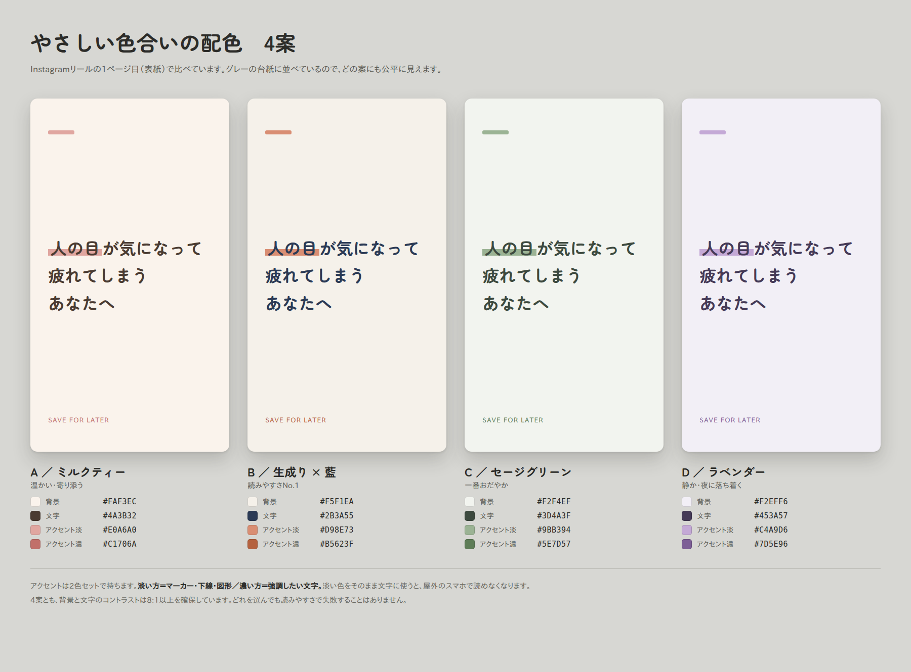

# 心理学 × Canva × Instagram：自動でページがめくれる投稿の作り方

作成日: 2026-08-29

## 概要
心理学をテーマに、「読み進めるうちに悩みが解決する／気持ちが軽くなる」Instagram投稿を作る。
ページが自動でめくれる形式を希望。

## 前提：形式の判断

| 形式 | 自動でめくれる | 作り方 | 向いている内容 |
|---|---|---|---|
| カルーセル（画像を横スワイプ） | ✕ できない | Canva → PNG書き出し | じっくり読ませたい／保存されたい |
| **リール（縦型動画）** | **○ できる** | **Canva → MP4書き出し** | **今回の希望はこちら** |
| ストーリーズ | △ 15秒ごとに自動送り | 画像/動画 | 24時間限定の補助 |

→ **リール（MP4）で作る。** Canvaの「ページの表示時間」＋「トランジション（切り替え効果）」で、
　 紙芝居のようにページが自動でめくれる動画になる。

補足：カルーセル版も同じ台本から作れる。まずリールで作り、後日カルーセルに焼き直して二度使うのが効率的。
（無料プランではサイズ自動変換が使えないため、新規に1080×1350を作り、要素をコピー＆ペーストで移す）

---

## 無料プランでやる場合のルール（Canva Free）

**結論：この作り方は無料プランで全部できる。** 有料が必要な機能を使わない構成にしてある。

### 無料でできること（今回使うのはここだけ）
- リールサイズ（1080×1920）のデザイン作成
- ページの追加・複製
- **ページごとの表示時間の設定**（自動でめくる仕組みの本体）
- **ページ間のトランジション**（切り替え効果）
- 文字のアニメーション（王冠マークがないもの）
- **MP4での書き出し**（透かし・ウォーターマークなし）
- デザインの複製（テンプレ化して量産）

### 有料（Canva Pro）でしかできないこと → 今回は使わない
| Pro機能 | 無料での代わり |
|---|---|
| ブランドキット（色・フォント登録） | 色コードをこのメモに書いておく／1本目を「テンプレ用」として残し、毎回複製する（複製すれば色もフォントも引き継がれる） |
| マジック変換（サイズ変更） | カルーセル版が要るときは、新規に1080×1350を作り、**ページの要素を全選択→コピー→貼り付け**で移す |
| 予約投稿（コンテンツプランナー） | **Instagramアプリ側の予約投稿機能**を使う（無料） |
| 背景除去・premium素材 | そもそも写真を使わない（文字＋背景色だけで作る） |
| フォントのアップロード | Canva内の無料日本語フォントから選ぶ |

### 無料で作るときの鉄則
1. **王冠マーク（👑）がついた素材・テンプレ・フォント・音源は使わない。**
   1つでも混ざると、書き出し時に有料表示か透かしが入る。
2. 素材を検索するときは、**フィルターで「無料」に絞る**。
3. **テンプレートから作らず、白紙から作る。**
   今回のような文字中心の投稿は、背景色＋テキストだけで完成する。
   無料テンプレを探す時間より、白紙に文字を置く方が速い。
4. フォントは選ぶ前に王冠マークがないか確認する。
   無料で使える日本語フォントの候補：Noto Sans JP / M PLUS 1p / M PLUS Rounded 1c / Zen Maru Gothic / Kosugi など
   （表示は変わることがあるので、実際の画面で王冠の有無を確認する）
5. 音楽は**Canvaでつけない**。無音でMP4を書き出し、Instagram側で音源をつける。
   → 無料音源を探す手間もゼロ、リーチも伸びる。一石二鳥。
6. 無料プランの保存容量は5GB。書き出し済みのMP4は、投稿後にCanvaの「アップロード」から削除する。

### 補足：文字だけのデザインは「安っぽい」わけではない
心理学系の投稿は、写真やイラストが入らない方が読みやすく、保存もされやすい。
無料プランの制約が、そのままこのジャンルの正解に一致している。

---

## 全体フロー（1本あたり 60〜90分／慣れたら30分）

1. ネタを決める（10分）
2. 台本を8枚に割る（20分）
3. Canvaで作る（30分）※2本目以降はテンプレ複製で10分
4. MP4で書き出す（5分）
5. キャプション・ハッシュタグを用意（10分）
6. 投稿（←ここは手動）

---

## STEP 1｜ネタを決める

### 選び方のルール
- 「悩み」から入る。心理学用語から入らない。
- 用語は**説明のための道具**であって、主役ではない。
- 1投稿＝1つの悩み＝1つの用語。詰め込まない。

### ネタ帳（悩み → 心理学の対応表）

| よくある悩み | 使える心理学 | 着地（軽くなるポイント） |
|---|---|---|
| 人の目が気になって疲れる | スポットライト効果 | 思ったほど見られていない＝自由 |
| 頑張っても満たされない | ヘドニック・アダプテーション（快楽順応） | 満たされないのは性格ではなく仕組み |
| 断れない／頼まれると引き受けてしまう | 一貫性の原理・返報性 | 断れないのは優しさの副作用 |
| 過去の失敗を夜に思い出す | ツァイガルニク効果（未完了は記憶に残る） | 忘れられないのは終わっていないだけ |
| 他人と比べて落ち込む | 社会的比較理論 | 比べる相手を選べば結果が変わる |
| やる気が出ない | 作業興奮／実行意図 | やる気は始めた後に出る |
| 自分に自信がない | インポスター現象 | 有能な人ほど陥る現象 |
| 完璧にできないと動けない | 全か無か思考（認知の歪み） | 60点で出す方が結果が伸びる |
| 嫌なことばかり覚えている | ネガティビティ・バイアス | 脳の初期設定であって、あなたの性格ではない |
| people pleasing / 顔色をうかがう | 承認欲求・条件付き自己価値 | 好かれる努力を減らすと関係が楽になる |

→ このリストを消費していけば、当面10本は作れる。思いついたらここに追記する。

---

## STEP 2｜台本テンプレ（8ページ構成）

「気持ちが軽くなる」には順番がある。**共感 → 命名 → 説明 → 転換 → 一歩** の流れを守る。

| # | 役割 | 中身 | 目安文字数 | 表示秒数 |
|---|---|---|---|---|
| 1 | 表紙（フック） | 悩みを本人の言葉で言い切る | 15〜25字 | 2.5秒 |
| 2 | 共感 | 「あるある」を具体的な場面で描く | 25〜35字 | 4秒 |
| 3 | 命名 | 「それ、◯◯という名前があります」 | 20〜30字 | 3.5秒 |
| 4 | 根拠 | 実験・研究の話を1つだけ | 30〜40字 | 5秒 |
| 5 | 理由 | なぜ起きるのか（＝あなたのせいではない） | 30〜40字 | 5秒 |
| 6 | 転換 | 見方が変わる一言 | 25〜35字 | 4.5秒 |
| 7 | 一歩 | 今日からできること **1つだけ** | 25〜35字 | 4.5秒 |
| 8 | 締め＋導線 | 気持ちが軽くなる言葉＋保存・フォロー誘導 | 20〜30字 | 3.5秒 |

合計 約32秒。リールとしてちょうどよい長さ（15〜60秒が扱いやすい）。

### 文字数を絞る理由
自動でめくれる＝**読み飛ばせない**。読み切れないと離脱する。
日本語は1秒あたり4〜6文字が快適な速度。**1ページ35字以内**を上限にする。
長い文は2ページに割る。

### 書き方のコツ
- 3ページ目の「命名」が一番効く。**感情に名前がつくだけで人は楽になる**（ラベリング効果）。
- 5ページ目は必ず「あなたのせいじゃない」に着地させる。原因を性格ではなく仕組みに置く。
- 7ページの「一歩」は、今日中にできる小さいものにする。「考え方を変えましょう」は不可。
- 説教しない。「〜すべき」「〜しましょう」を「〜だけでいい」「〜してみるのもあり」に変える。

---

## STEP 3｜Canvaでの作り方

### 3-1. デザインを作成
- Canva → 「デザインを作成」→ **「Instagramリール」**（1080 × 1920px／縦9:16）
- **テンプレートは使わず、白紙から作る**（無料プランでは王冠マークの混入を避けるのが一番確実）
- 背景は「背景色」から単色を指定するだけでよい

### 3-2. 安全余白（重要）
Instagramのリールは画面の上下にUI（ユーザー名・キャプション・いいねボタン等）が重なる。
文字は**中央のエリアに収める**。
- 上から約250px、下から約450px、左右から約100px は文字を置かない
- Canvaの「ファイル → 設定 → 定規とガイドを表示」でガイド線を引いておくと毎回ラク

### 3-3. デザインの統一ルール（先に決めて固定する）
- **フォント**：見出し＝太めのゴシック（例：Noto Sans JP Bold / M PLUS）、本文＝同じファミリーの Regular。2種類まで。
  → **選ぶ前に王冠マーク（👑）がないか確認する。**ついていたら別の無料フォントにする。
- **文字サイズ**：見出し 70〜90pt、本文 45〜55pt。小さくしない。
- **色**：背景1色＋文字1色＋アクセント1色の計3色まで。→ 下記「配色4案」から1案選んで固定する。
- **余白**：文字は画面の6割まで。詰めない。余白が「軽さ」を作る。
- **1ページ1メッセージ**。

### 3-4. ページを8枚作る
- 台本どおりに8ページ分のテキストを配置
- ページの複製（ページ右上の複製アイコン）で作ると、位置がズレない

### 3-5. 自動でめくれるようにする（ここが本題）
1. 下部の**タイムライン**（動画編集バー）を開く
2. 各ページの下にある**時計マーク／表示時間**をクリックし、STEP2の表で決めた秒数を入力
3. ページとページの間にある**トランジションのマーク**をクリック
   - 「ディゾルブ」または「スライド」を選ぶ
   - 継続時間は 0.3〜0.5秒
   - **「すべてのページに適用」にチェック**（統一されて安っぽく見えなくなる）
4. 文字のアニメーション（任意）
   - テキストを選択 → 「アニメート」→「フェード」または「タイプライター」（**王冠マークのないもの**を選ぶ）
   - **全ページで同じものに統一する**。ページごとに変えると素人っぽくなる
5. 左下の再生ボタンで通しで見て、**読み切れるか**を確認する
   - 声に出して読んで、間に合わなければ +1秒 か 文字を削る

### 3-6. 音楽
**Canvaでつけない。無音のままMP4で書き出し、Instagramのアプリ側で音源を追加する。**
- Canvaの音源は無料プランだと選べるものが少なく、王冠マークのものを使うと書き出せない
- Instagram側の音源はすべて無料で、トレンド音源を使えるのでリーチも伸びやすい
→ 無料プランでは迷わずこちら。

---

## 配色4案（やさしい色合い）

見本画像：`assets/00_配色4案_比較.png`（比較シート）／`assets/案A〜D.png`（実寸1080×1920）
見本ページ：https://claude.ai/code/artifact/fc4fb099-e9f7-46f7-8a82-5a2e77732bfb



**アクセントは2色セットで持つ。** 淡い方＝マーカー・下線・図形用／濃い方＝強調文字用。
淡い色をそのまま文字に使うと、屋外のスマホで読めなくなる（やさしい色合いで一番多い失敗）。

### A｜ミルクティー
温かい。寄り添っている感じ。人間関係・自己肯定感・しんどい気持ちの回に。

| 役割 | 色コード |
|---|---|
| 背景 | `#FAF3EC` |
| 文字 | `#4A3B32` |
| アクセント淡（マーカー・図形） | `#E0A6A0` |
| アクセント濃（強調文字） | `#C1706A` |

### B｜生成り × 藍 ★迷ったらこれ
文字が一番はっきり読める。やさしさと信頼感の両立。研究の話を入れる回に。長く続けても飽きにくい。

| 役割 | 色コード |
|---|---|
| 背景 | `#F5F1EA` |
| 文字 | `#2B3A55` |
| アクセント淡 | `#D98E73` |
| アクセント濃 | `#B5623F` |

### C｜セージグリーン
一番穏やか。主張が弱いぶん文章を読ませる。休息・自律神経・頑張りすぎの回に。

| 役割 | 色コード |
|---|---|
| 背景 | `#F2F4EF` |
| 文字 | `#3D4A3F` |
| アクセント淡 | `#9BB394` |
| アクセント濃 | `#5E7D57` |

### D｜ラベンダー
夜に見て落ち着く色。心理学らしさが一番出る。眠れない・考えすぎ・不安の回に。

| 役割 | 色コード |
|---|---|
| 背景 | `#F2EFF6` |
| 文字 | `#453A57` |
| アクセント淡 | `#C4A9D6` |
| アクセント濃 | `#7D5E96` |

※4案とも背景と文字のコントラストは8:1以上を確保済み。屋外のスマホでも読める。

### Canvaでの色の入れ方
- **背景色**：ページの余白をクリック → 上部「背景色」→「+」→ 色コードを入力（`#`は不要）
- **文字色**：テキストを選択 → 「A」アイコン → 「+」→ 色コードを入力
- 一度使った色は「ドキュメントの色」としてそのデザイン内に残る。
  → 1本目を「テンプレート用」として保存し複製すれば、毎回入力し直す必要はない（ブランドキットの無料版代わり）

### 途中で色を変える場合
1本ごとに変えない。**5〜10本まとめて変える。**
1本ずつ違うと、プロフィール画面のグリッドがちぐはぐに見える。

---

## STEP 4｜書き出し

- 右上「共有」→「ダウンロード」→ ファイルの種類 **MP4形式の動画**
- 品質：そのまま（1080p）
- 全ページにチェックが入っているか確認
- **「Proの要素が含まれています」等の表示が出たら、王冠マークの素材が混ざっている。** その要素を探して無料のものに差し替える
- ダウンロードしてスマホに転送（AirDrop、Googleドライブ、LINEのKeepなど）

### カバー画像（サムネイル）も作る
- 同じデザインで1ページ目だけをPNGで書き出しておく
- 投稿時に「カバーを編集」から選ぶと、プロフィール画面のグリッドが揃う

---

## STEP 5｜投稿直前に用意しておくもの

### キャプションの型
```
（1行目＝表紙と同じ言葉。ここだけ表示される）

（2〜3行の補足。動画に入れ切れなかった話や、自分の体験）

（問いかけ：「あなたはどうですか？」など、コメントしやすいもの）

保存して、しんどい日に見返してください。
心理学で気持ちを軽くする投稿をしています → @（アカウント名）

#心理学 #メンタルケア #自己肯定感 #考え方 #人間関係の悩み
#心理学好きな人と繋がりたい #生きづらさ #マインドセット
```

### ハッシュタグ
- 10〜15個。多すぎると逆効果。
- 大きいタグ（#心理学）と小さいタグ（#スポットライト効果）を混ぜる。
- 毎回まったく同じ組み合わせにはしない。

---

## 投稿前チェックリスト

- [ ] 王冠マーク（👑）の素材・フォント・音源が混ざっていない
- [ ] 8ページすべてに表示時間を設定した
- [ ] トランジションを全ページ統一した
- [ ] 通しで再生して、全ページ読み切れた
- [ ] 上下の安全余白に文字がはみ出していない
- [ ] 誤字脱字（特に表紙）
- [ ] 心理学用語のスペル・名称が合っている
- [ ] 「一歩」が今日できる内容になっている
- [ ] MP4で書き出した／スマホに入れた
- [ ] カバー画像を用意した
- [ ] キャプションとハッシュタグを用意した

---

## 発信するうえでの注意点

- 断定を避ける。「〜と言われています」「〜という研究があります」に留める。
- **診断・治療的な表現をしない。**「あなたは◯◯です」「これで治ります」は書かない。
- しんどさが強い場合は専門機関へ、という一文を、重いテーマの回では入れる。
- 研究を引用するときは、研究者名か年代をキャプションに書いておくと信頼が上がる。
- 誰か（特定の人・属性）を悪者にする構成にしない。読後感が重くなる。

---

## 実例：1本目の台本（そのまま使える）

**テーマ：人の目が気になって疲れる／スポットライト効果**

| # | 表示テキスト | 秒 |
|---|---|---|
| 1 | 人の目が気になって<br>疲れてしまうあなたへ | 2.5 |
| 2 | 帰り道。<br>「あの言い方、変じゃなかったかな」<br>何度も再生してしまう。 | 4.5 |
| 3 | それ、<br>「スポットライト効果」<br>という名前がついています。 | 3.5 |
| 4 | ある実験では、<br>目立つ服を着た人が<br>「半分の人は気づくはず」と予想。<br>実際に気づいたのは、その半分以下でした。 | 5.5 |
| 5 | 人は、自分の視点からしか<br>世界を見られない。<br>だから自分だけが<br>舞台の中央にいる気がする。 | 5 |
| 6 | でも今日すれ違った人も、<br>自分のことで頭がいっぱいです。 | 4.5 |
| 7 | 気になったら、ひとつだけ。<br>「相手はこれ、何分覚えてる？」<br>と自分に聞いてみてください。 | 4.5 |
| 8 | 見られていないことは、<br>寂しさじゃなくて自由です。<br><br>保存して、気になった日に。 | 3.5 |

合計 33.5秒

キャプション1行目：`人の目が気になって疲れてしまうあなたへ`

---

## 2本目以降の量産手順

1. 1本目のCanvaデザインを**「コピーを作成」**
2. テキストだけ差し替える（デザイン・秒数・トランジションはそのまま残る）
3. 色は複製すれば引き継がれる（ブランドキットは有料なので不要）
   - デザイン内で使った色は「ドキュメントの色」として残るので、無料でも毎回同じ色が使える

1本目を **「テンプレート用（複製して使う）」** という名前で保存し、それ自体は編集しないでおく。

→ これで1本10〜15分。**まとめて3本作っておく**運用にすると、続けやすい。

### 予約投稿について
Canvaの予約投稿機能は有料。無料でやるなら **Instagramアプリ側の予約投稿**を使う。
（投稿画面の「詳細設定」→「この投稿を日時指定」）
まとめて作った3本を、そのまま日付を分けて予約しておける。

---

## 次のアクション

- [ ] 配色4案からA〜Dを1つ選ぶ（→ 選んだらここに記入：　　　）
- [ ] Canvaで1本目（スポットライト効果）を作る
- [ ] フォントを決めて固定する（1回決めれば以降不要）
- [ ] 作ったデザインを「テンプレート用」として残しておく
- [ ] ネタ帳の残り9本から、次に作る2本を選ぶ
